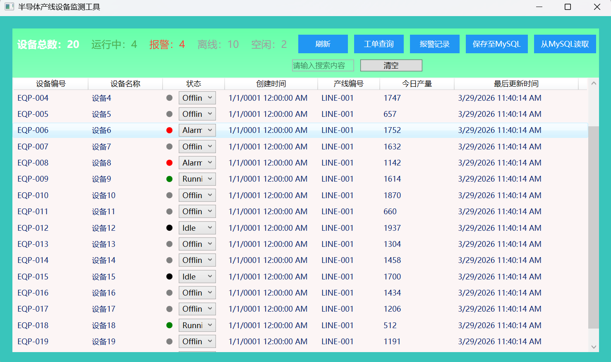
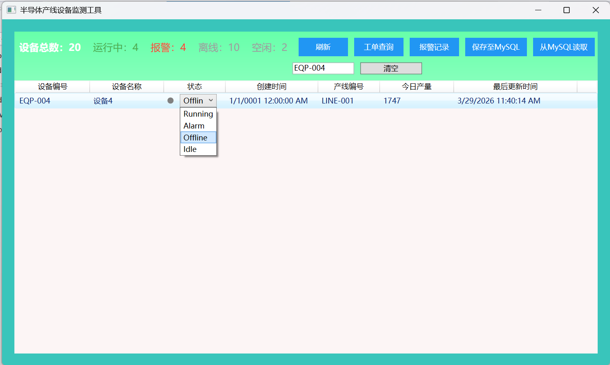
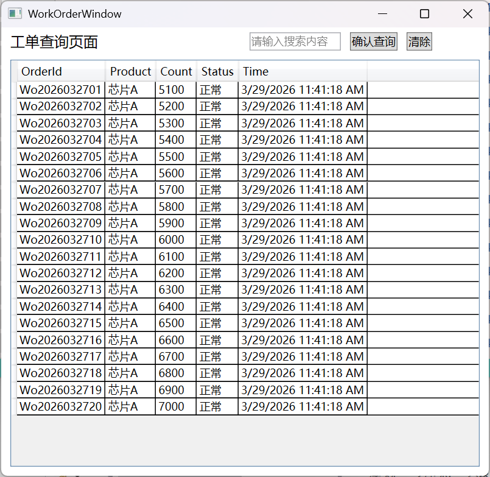
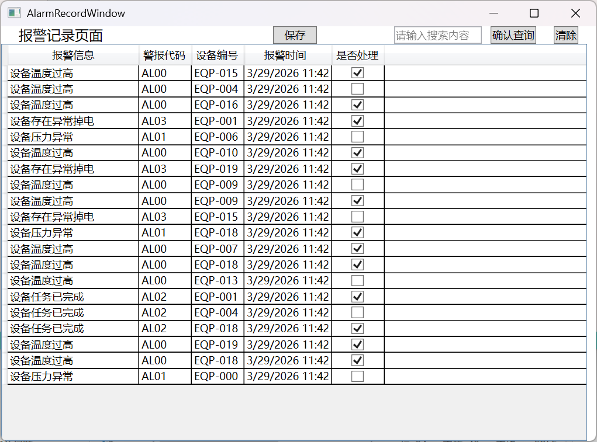
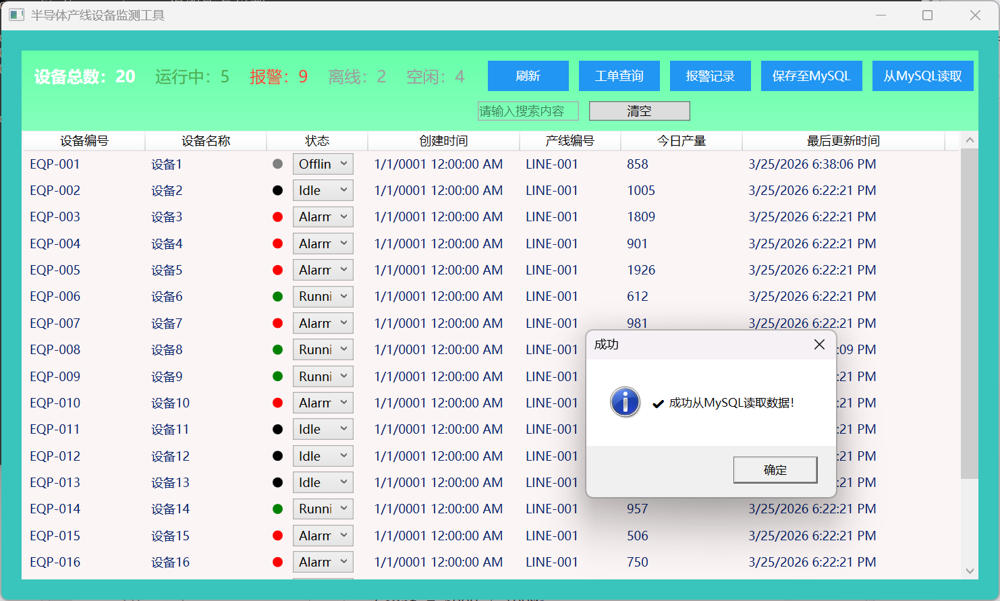
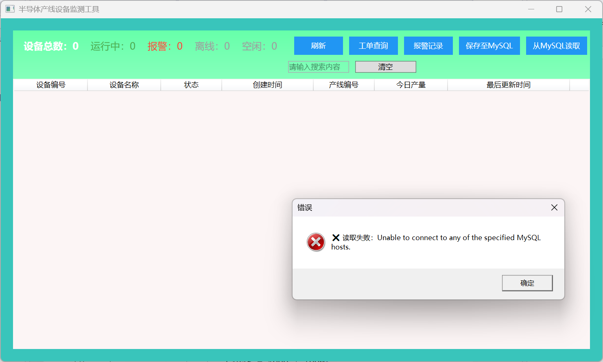

# Semiconductor Equipment Monitor
半导体设备监控系统 | WPF + MVVM + MySQL

## 项目简介
基于 WPF 开发的半导体设备实时监控桌面应用，采用 MVVM 架构模式，搭配 MySQL 实现数据存取。
主要用于设备状态监控、生产工单管理、异常告警记录、数据查询与编辑等场景，助力产线运维高效管理。

## 未来功能 （ToDo）
 ### 视觉识别功能
 通过HalCon对工单信息生成的二维码进行识别、读取
 ### 多线程更新优化
 通过Dispatcher优化线程执行，减少单一线程卡顿问题
 ### 数据库链接加密功能
 当前为Demo版本，实际生产环境建议使用App.config加密存储连接串

## 技术栈
- 框架：.NET / WPF
- 架构：MVVM
- 数据库：MySQL
- 开发工具：Visual Studio 2022
- 核心功能：数据绑定、异步刷新、异常告警、工单管理、搜索编辑

## 核心功能
- 设备运行状态实时展示与监控
- 生产工单管理与追踪
- 异常告警记录与查询
- 设备信息搜索与状态编辑
- 操作成功/异常提示反馈
- 完整数据库 CRUD 操作

## 界面预览
### 主界面 / 设备总览


### 搜索与状态编辑


### 生产工单管理


### 告警记录查询


### 操作成功提示


### 异常错误提示


## 快速启动
1. 克隆本项目到本地
2. 执行项目中的 SQL 脚本创建数据库与表
3. 修改配置文件中的数据库连接字符串
4. 使用 Visual Studio 打开解决方案
5. 还原 NuGet 包，直接运行即可

## 项目结构
```
#Views         # 页面视图（XAML）
#ViewModels    # MVVM 业务逻辑
#Models        # 实体Equipment模型
#Services      # 数据库服务 & 接口
#screenshots   # 项目截图
```

## 作者
kianliano

## 说明
本项目为学习实战项目且有待完善，用于个人作品集展示，未经许可请勿用于商业用途。
